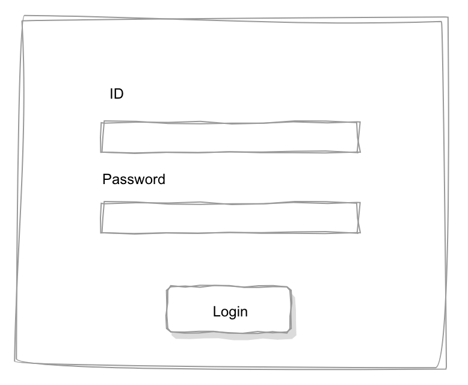

# react-tdd

TDD の練習

## 仕様

今回のテスト対象として簡単なログイン画面を作る。  

仕様は以下とする

- ログイン仕様
  - ID 欄には email アドレスが入力されること
  - Password は６文字以上であること
  - 今回は ID,Password が正しく入力されている状態で LoginButton を押したら成功とする
  - (今回は決めで ID:test@example.com, Password:password123#)
- 画面項目
  - ID を入力するテキストボックス
    - 必須入力
    - type=text
    - email の入力を想定
    - 入力値は email のパターンに沿っていない場合、テキストボックスのすぐ下にパターンに沿っていない旨を表示
    - email のパターンチェックタイミングは、onchange 時
    - email のパターンチェックが正しいときは、ターンに沿っていない旨のメッセージは表示しない
  - Password を入力するテキストボックス
    - 必須入力
    - type=password
    - 入力値が 6 文字未満の場合、テキストボックスのすぐ下に文字数不足の旨を表示
    - Password の文字数チェックタイミングは、onchange 時
    - Password の桁数に問題ないときは、文字数不足の旨のメッセージは表示しない
  - Login ボタン
    - ID とパスワードが Validation 処理を突破していない場合は、ボタンが押せないこと
    - 問題がなければボタン下に成功の旨を表示
    - ログインできなかった場合は、できなかった旨をボタン下にメッセージを表示する(今回は決めで ID:test@example.com, Password:password123#以外は失敗扱い)

# テスト方針

テストとしては、トップダウンでもボトムアップでも行える（はず）。実際は、トップダウンは簡単だが、大きいプロジェクトの場合はトップダウンでのテストは難しくなるので、ボトムアップでテストしながらやっていくのが良いでしょう。

## テスト対象

最低限以下はチェックしていく

- レンダリングのテスト
  - エラーが出ていないこと
  - 構文エラーが出ていないこと
  - アウトプットが null でないこと
- 状態のテスト
  - ログイン失敗時や成功時の動作
- イベントのテスト
  - onclick, focusout などのイベント
